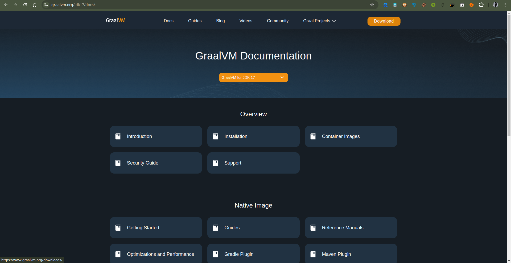
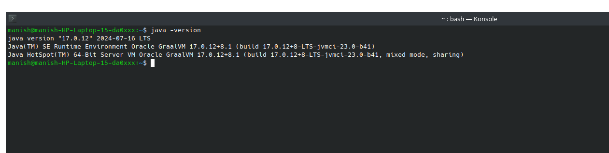
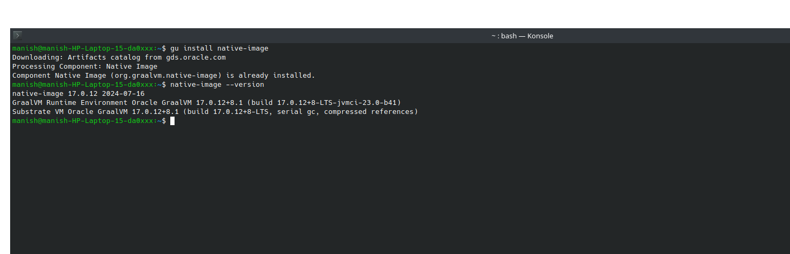
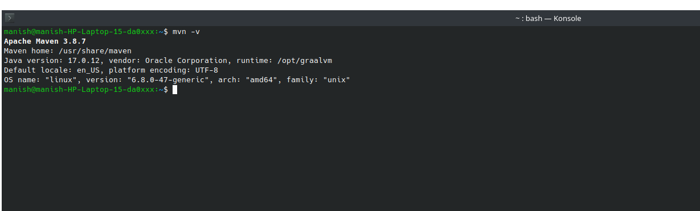
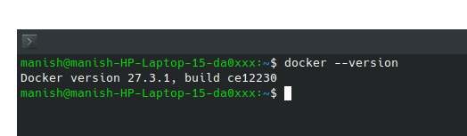
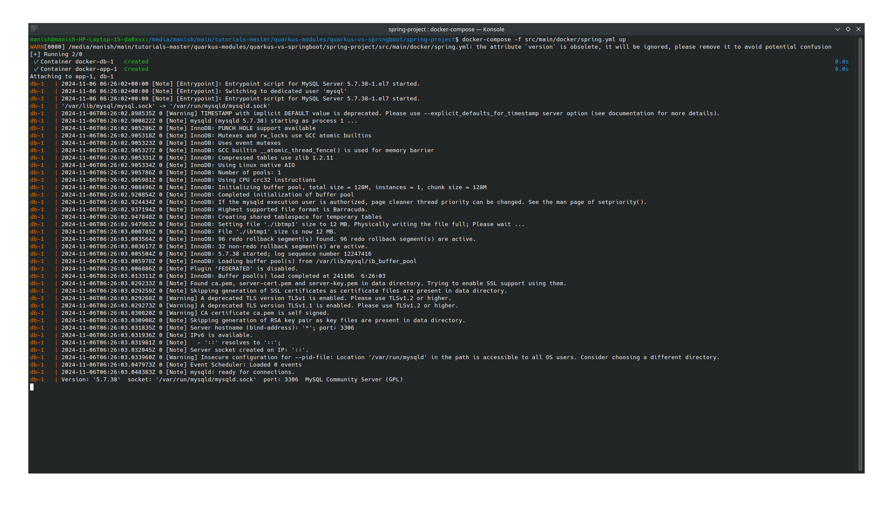
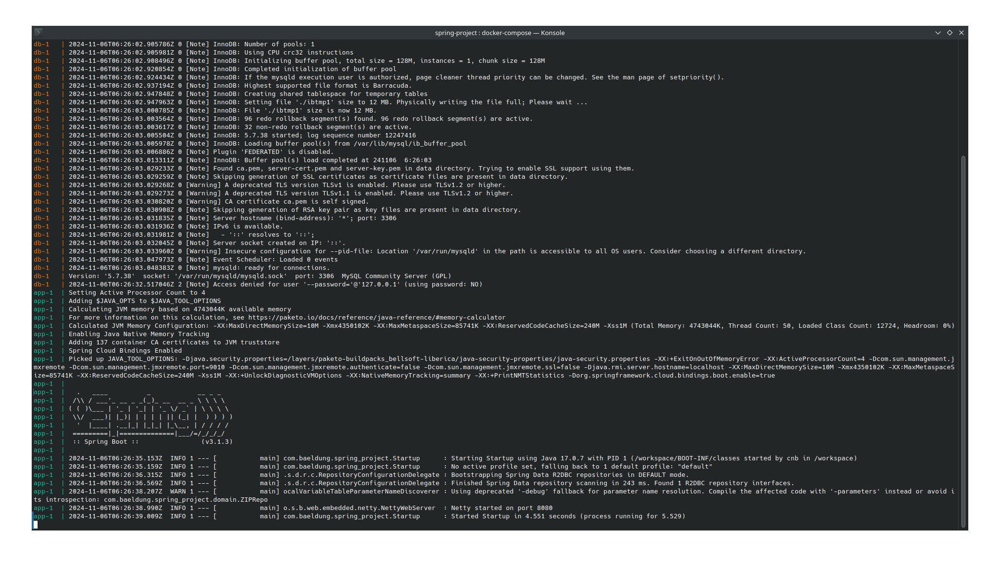
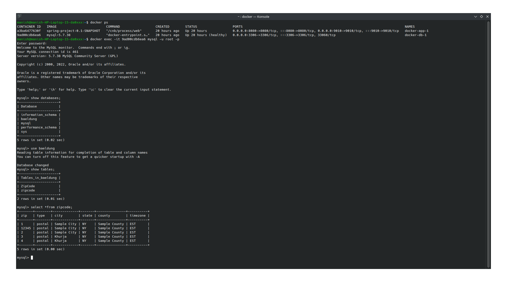

### Original GitHub Repository:
[GITHUB] (https://github.com/eugenp/tutorials/tree/master/quarkus-modules/quarkus-vs-springboot)
## Objective:
Run the application in this project and compare the performance of Quarkus and Springboot
## Springboot:
 ### Install 
- GRAALVM (https://www.graalvm.org/)
- Maven (https://maven.apache.org/download.cgi)
- Docker(https://docs.docker.com/engine/install/ubuntu/)

##Step 1: GRAALVM Install process for Ubuntu:

 1. **First, update your package lists:**
 
   ```bash
   sudo apt update && sudo apt upgrade
   ```
 2. **Download GraalVM**
 Go to the GraalVM Releases page.
 
 3. **Extract the GraalVM Archive:**
  After downloading, extract the archive using the following command:
   ```
   tar -xvzf graalvm-ce-java17-linux-amd64-17.0.12.tar.gz
   ```
 4. **Move the GraalVM Directory:**
  Move the extracted directory to /usr/lib/jvm:
   ```bash
   sudo mv graalvm-ce-java17-17.0.12 /usr/lib/jvm/
   ```
 5. **Configure Environment Variables:**
 To use GraalVM, you'll need to configure the environment variables:

  1.Open the .bashrc file
   ```bash
   nano ~/.bashrc
   ```
  2.Add the following lines to set GraalVM as the default JDK:
   ```bash
   export GRAALVM_HOME=/usr/lib/jvm/graalvm-ce-java17-17.0.12
   export PATH=$GRAALVM_HOME/bin:$PATH
   ```
  3.Apply the changes:
   ```
   source ~/.bashrc
   ```

6. **Set GraalVM as the Default Java Version:**
To make GraalVM the default Java version
 ```bash
  sudo update-alternatives --install /usr/bin/java java /usr/lib/jvm/graalvm-ce-java17-17.0.12/bin/java 1
  sudo update-alternatives --config java
 ```
7. **Verify Installation:**
Check if GraalVM is installed properly:
 ```bash
 java -version
 ```
 
8. **Install Native Image Tool**
To use GraalVM for native image generation, install the native-image tool:
 ```bash
  gu install native-image
 ```
 


## Step 2:Maven

1. **Update the Package Index**
    ```bash
     sudo apt update
    ```
2. **Install Maven using APT**
   Ubuntu's default package repository contains Maven, so you can install it directly using the apt package 
   manager. To do this, run:

    ```bash
    sudo apt install maven
    ```
This will install Maven and its dependencies.

3. **Verify the Installation**
   Once Maven is installed, you can verify the installation and check the version of Maven to ensure everything 
   is set up correctly. Run:

  ```bash
  mvn -version
  ```



## Docker:
1. **Update the System**
Make sure your system is up to date:
 ```bash
 sudo apt update && sudo apt upgrade
 ```
2. **Install Required Packages**
Install necessary packages for Docker installation:
 ```bash
  sudo apt install apt-transport-https ca-certificates curl software-properties-common
 ```
3. **Add Docker’s GPG Key**
Add Docker’s official GPG key to your system:
 ```bash
  curl -fsSL https://download.docker.com/linux/ubuntu/gpg | sudo gpg --dearmor -o /usr/share/keyrings/docker-archive-keyring.gpg
 ```
4. **Add the Docker Repository**
Add Docker’s official repository to the APT sources:
 ```bash
  echo "deb [arch=$(dpkg --print-architecture) signed-by=/usr/share/keyrings/docker-archive-keyring.gpg] https://download.docker.com/linux/ubuntu $(lsb_release -cs) stable" | sudo tee /etc/apt/sources.list.d/docker.list > /dev/null
 ```
5. **Install Docker**
Update the package database and install Docker:
 ```bash
 sudo apt update
 sudo apt install docker-ce docker-ce-cli containerd.io
 ```
6. **Start and Enable Docker**
Start the Docker service and ensure it starts on boot:
  ```bash
   sudo systemctl start docker
   sudo systemctl enable docker
  ```
7. **Verify Installation**
Check if Docker is installed and running:
 ```bash
  docker --version
 ```


## SpringBoot
To build the application, you only need to run the following command in the Spring project root:
```bash
 mvn clean package -f pom.xml
```
Or this one in case you want to build the native one:
```bash
mvn clean package -Pnative -f pom.xml
```
In this case, you will need to have the GRAALVM_HOME env variable defined. You only need this if you want to build the image locally. Otherwise, you can build it using docker by leveraging the Spring Boot maven plugin. It will pull a docker image of the GraalVM, and with that, it will create the native image of the app. To do that, run:

```bash
 mvn clean package spring-boot:build-image -Pnative -f pom.xml
```
You can execute the script start_app.sh or start_jvm.sh to run the application locally. In this case, you will need the Mysql DB. You can run it in docker with the command:
```bash
 docker run --name mysqldb --network=host -p 3306:3306 -e MYSQL_ROOT_PASSWORD=root -e MYSQL_DATABASE=baeldung -d mysql:5.7.38 --character-set-server=utf8mb4 --collation-server=utf8mb4_unicode_ci
```
You can also run both application and DB from docker, using:

```bash
docker-compose -f src/main/docker/spring.yml up
```
**successfully run**





